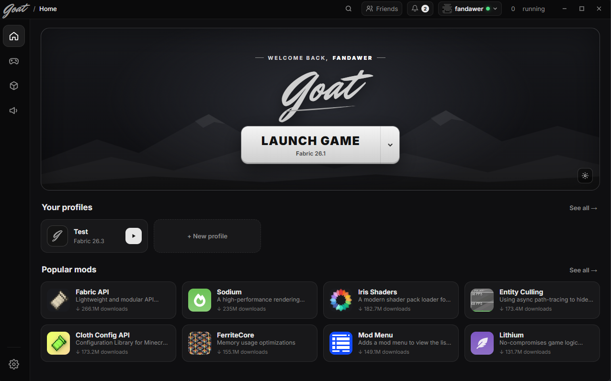
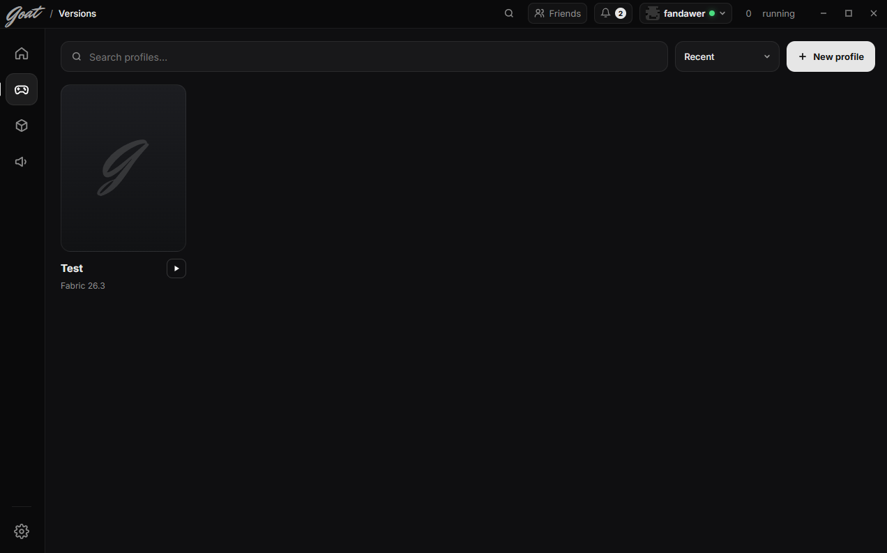

# Goat Client

> **Work in progress** - Goat Client is in early development (v0.1).

Goat Client is a custom launcher for **Minecraft: Java Edition** with built-in mods and profiles.

## Screenshots

## Features

- Launch Minecraft: Java Edition with your own profiles and versions
- Built-in mods (e.g. Hitbox - colors, line width and a skin preview)
- Coming soon: Keystrokes, CPS and FPS mods with their own settings

## Sign in

Goat Client uses the **official Microsoft account sign-in** (Microsoft identity platform, Xbox Live, Minecraft services).
You need to own Minecraft: Java Edition to play. Goat Client does **not** bypass any authentication, license or security checks and does not support offline/cracked accounts.

## Status

Goat Client is under active development. The UI, profiles and first mods are working; Microsoft sign-in is waiting for Minecraft API approval.

## Disclaimer

Goat Client is not affiliated with or endorsed by Mojang Studios or Microsoft.
