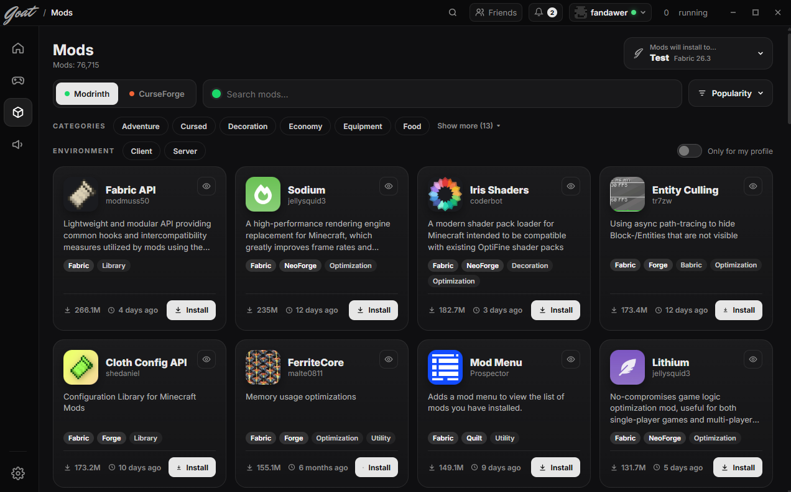

# Goat Client

> **Work in progress** - Goat Client is in early development (v0.1).

Goat Client is a fast, clean launcher for **Minecraft: Java Edition** with profiles, built-in mods and a mod browser for Modrinth and CurseForge - all in one place.

## Screenshots

### Home

### Profiles

### Mods

## Features

- **One-click launch** - start Minecraft: Java Edition right from the home screen
- **Profiles** - create separate profiles, each with its own game version and mod loader (Fabric)
- **Mod browser** - search and install mods from **Modrinth** and **CurseForge**, filter by category, environment (client / server) and popularity, and pick which profile they install to
- **Built-in mods** - e.g. Hitbox (colors, line width and a skin preview)
- **Friends and notifications** - see your friends and stay up to date
- **Modern dark UI** - clean and minimal design

### Coming soon

- Keystrokes, CPS and FPS mods with their own settings
- More built-in mods and customization options

## Sign in

Goat Client uses the **official Microsoft account sign-in** (Microsoft identity platform, Xbox Live, Minecraft services).
You need to own Minecraft: Java Edition to play. Goat Client does **not** bypass any authentication, license or security checks and does not support offline/cracked accounts.

## Status

Goat Client is under active development. The UI, profiles, mod browser and first mods are working; Microsoft sign-in is waiting for Minecraft API approval.

## Links

- Website: [goatclient.eu](https://goatclient.eu)
- YouTube: [@GoatClientOfficial](https://www.youtube.com/@GoatClientOfficial)
- TikTok: [@goatclient](https://www.tiktok.com/@goatclient)

## Disclaimer

Goat Client is not affiliated with or endorsed by Mojang Studios or Microsoft.
